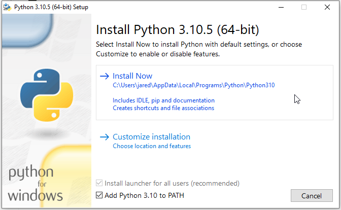
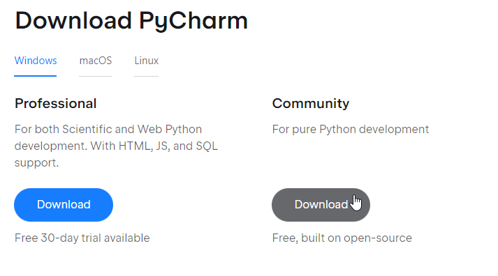
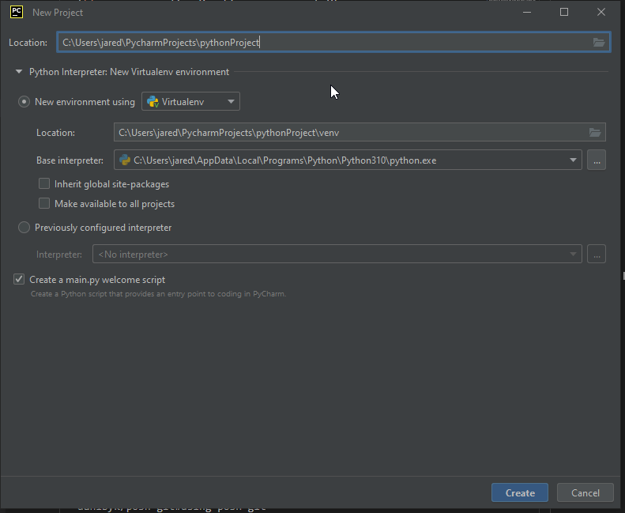
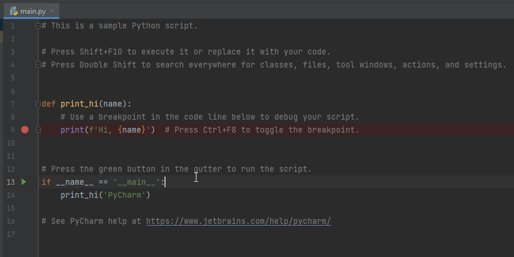
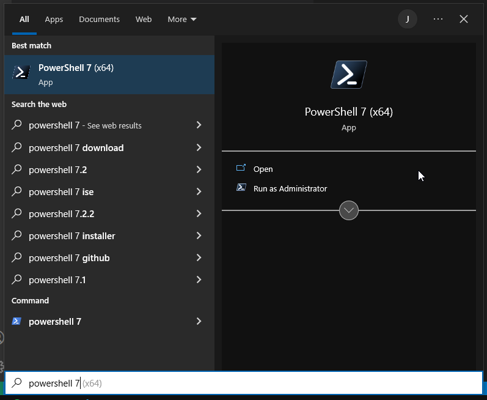
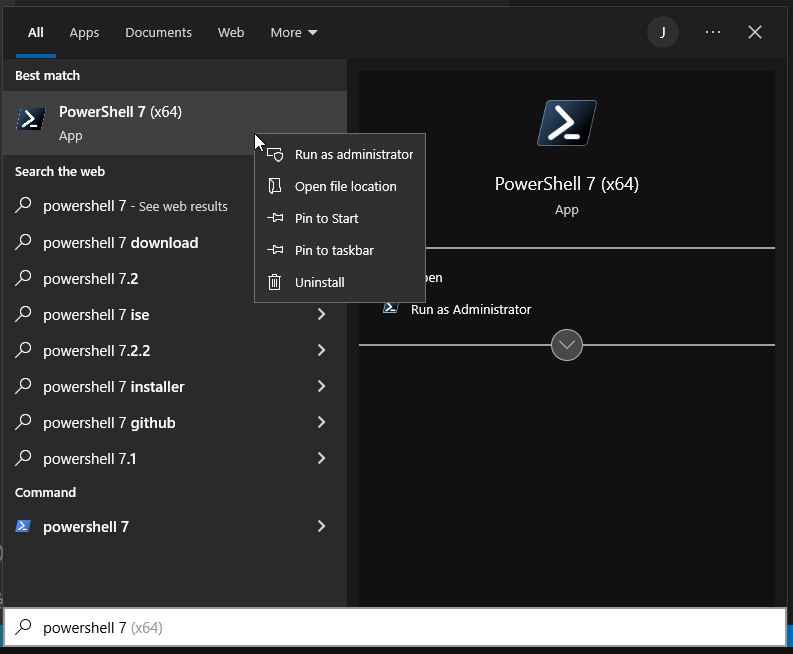
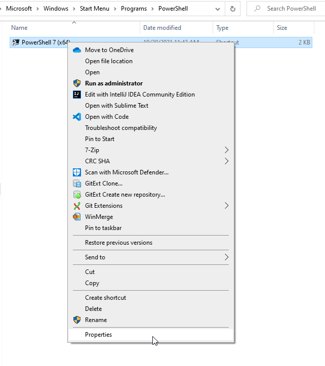
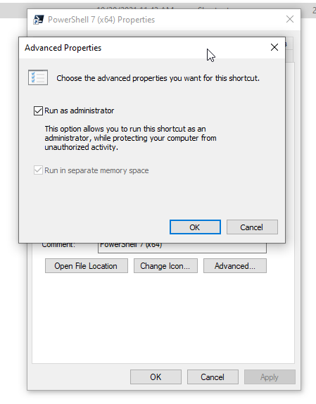

# Windows
1. Install Python: https://www.python.org/downloads/
   1. Make sure `Add Python 3.10 to PATH` is checked 
1. Install PyCharm
   1. Download here https://www.jetbrains.com/pycharm/download/#section=windows
   1. Select the Community edition 
1. Create a new PyCharm project
   1. It should auto-detect Python 
   1. Run the program by clicking on the green arrow on the left-hand side 
1. Install PowerShell 7: https://docs.microsoft.com/en-us/powershell/scripting/install/installing-powershell-on-windows?view=powershell-7.2
1. Make PowerShell run with admin privileges
   1. Search for "Powershell 7" in the start menu 
   1. Right-click and select "Open file location" 
   1. Right-click and select "Properties" 
   1. Click on "Advanced..." and check "Run as administrator" 
1. Install packages in PowerShell 7
   1. Install Chocolatey package manager https://chocolatey.org/install
   1. Install git
      ```
      choco install git -y
      ```
   1. Install posh-git
      ```
      choco install poshgit -y
      ```
   1. Auto-import posh-git https://github.com/dahlbyk/posh-git#using-posh-git

# macOS
TODO